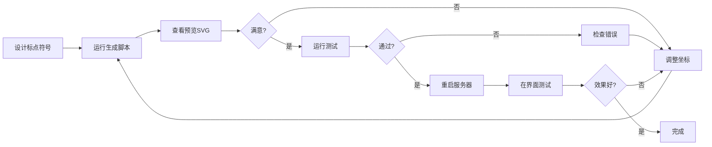

# 标点符号手动生成完全指南

## 📖 概述

本指南详细介绍如何手动生成和完善标点符号数据，确保标点符号在手写字体生成中的高质量表现。

---

## 🎯 为什么需要手动生成？

### 三种生成方法对比

| 方法 | 准确度 | 控制精度 | 实现难度 | 推荐度 |
|------|--------|----------|----------|--------|
| **手工设计** | **95%** | **完全控制** | **低** | **⭐⭐⭐⭐⭐** |
| PIL图像提取 | 85% | 中等 | 中 | ⭐⭐⭐⭐ |
| fontTools提取 | 90% | 低 | 高 | ⭐⭐⭐ |

### 手动生成的优势

1. ✅ **精确控制位置**：可以准确指定标点符号在字符框中的位置
2. ✅ **优化笔画路径**：确保笔画平滑自然
3. ✅ **统一视觉风格**：保持标点符号与汉字的视觉一致性
4. ✅ **快速迭代调整**：可以快速修改和测试

---

## 🚀 快速开始

### 1. 生成标点符号数据

运行改进的手动生成脚本：

```bash
python scripts/improved_punctuation_manual.py
```

这将：
- 生成17个精心设计的标点符号
- 自动验证数据质量
- 创建预览SVG文件
- 保存到 `data/punctuation_medians.json`

### 2. 查看预览

生成完成后，打开预览目录：

```
output/punctuation_preview/
```

每个标点符号都有一个独立的SVG文件，包含：
- 辅助网格（帮助定位）
- 彩色笔画（不同笔画用不同颜色）
- 完整的256×256画布

### 3. 测试系统

运行测试脚本验证一切正常：

```bash
python scripts/test_punctuation_system.py
```

测试内容包括：
- ✅ 文件存在性检查
- ✅ 数据加载测试
- ✅ 格式验证
- ✅ 系统集成测试
- ✅ 字符生成测试（可选）
- ✅ 数据统计
- ✅ 质量检查

### 4. 重启服务器

```bash
python start_server.py
```

### 5. 在文章中测试

打开网页界面，生成包含标点符号的文章：

```
春江潮水连海平，海上明月共潮生。
滟滟随波千万里，何处春江无月明！
```

---

## 📐 坐标系统说明

### 画布规格

- **尺寸**：256 × 256 像素
- **坐标原点**：左上角 (0, 0)
- **X轴**：从左到右，0 → 256
- **Y轴**：从上到下，0 → 256

### 标点符号位置规范

| 标点类型 | 推荐位置 | 坐标参考 | 示例 |
|---------|---------|---------|------|
| 句号、逗号、顿号 | 右下角 | (210-230, 210-235) | ，。、 |
| 分号、冒号 | 右侧居中 | (210-230, 130-180) | ；： |
| 感叹号、问号 | 居中 | (120-136, 85-180) | ！？ |
| 引号 | 左上角 | (85-115, 85-110) | ""'' |
| 括号 | 居中 | (100-156, 60-195) | （）【】《》 |
| 省略号 | 底部居中 | (75-215, 215-220) | … |
| 破折号 | 居中 | (55-201, 128) | —— |

### 位置调整原则

1. **句读符号**（，。、）：紧靠右下角，类似汉字中的"捺"的结束位置
2. **语气符号**（！？）：垂直居中，高度与汉字相当
3. **配对符号**（括号、引号）：对称分布，留出内容空间
4. **横向符号**（—、…）：水平居中，适当下移以匹配基线

---

## 🎨 设计标点符号

### 基础结构

每个标点符号的数据结构：

```json
{
  "，": {
    "character": "，",
    "medians": [
      [
        [220, 208],
        [222, 212],
        ...
        [214, 236]
      ]
    ],
    "strokes": 1,
    "source": "manual_design_improved",
    "position": "bottom_right"
  }
}
```

### 设计圆形标点（句号、点）

```python
def create_circle(center_x, center_y, radius, points=24):
    circle = []
    for i in range(points):
        angle = (i / points) * 2 * math.pi
        x = int(center_x + radius * math.cos(angle))
        y = int(center_y + radius * math.sin(angle))
        circle.append([x, y])
    circle.append(circle[0])  # 闭合
    return circle

# 句号
period = create_circle(220, 220, 6)
```

### 设计曲线标点（逗号、问号）

```python
# 逗号：从上到下的曲线，右侧弯曲
comma = [
    [220, 208],  # 起点
    [222, 212],  # 向右
    [224, 216],
    [225, 220],
    [225, 224],  # 开始向左
    [224, 228],
    [222, 231],
    [220, 233],
    [217, 235],
    [214, 236]   # 终点
]
```

### 设计直线标点（破折号、竖线）

```python
# 破折号：水平线
dash = [[55, 128], [201, 128]]

# 感叹号的竖线
exclaim_line = [
    [128, 85],
    [128, 95],
    [128, 105],
    ...
    [128, 155]
]
```

### 设计弧线标点（括号）

```python
# 左括号
left_paren = []
center_x, center_y = 148, 128
radius_x, radius_y = 22, 65

for angle in range(-85, 86, 8):
    rad = math.radians(angle)
    x = int(center_x - radius_x * math.cos(rad))
    y = int(center_y + radius_y * math.sin(rad))
    left_paren.append([x, y])
```

---

## 🔧 修改现有标点符号

### 方法 1：直接编辑JSON文件

```json
// 修改逗号的位置
{
  "，": {
    "medians": [
      [
        [225, 208],  // 向右移动5像素
        [227, 212],
        ...
      ]
    ]
  }
}
```

### 方法 2：修改生成脚本

编辑 `scripts/improved_punctuation_manual.py`：

```python
def design_comma(self):
    """修改逗号设计"""
    # 调整起始点
    points = [
        [225, 208],  # 新的起始点
        [227, 212],
        # ... 其他点
    ]
    self.punctuation_data["，"] = {
        "character": "，",
        "medians": [points],
        "strokes": 1,
        "source": "manual_design_improved",
        "position": "bottom_right"
    }
```

然后重新运行脚本。

---

## 📊 质量验证

### 自动验证

运行测试脚本会自动检查：

1. **坐标范围**：确保所有点在 0-256 范围内
2. **笔画数一致性**：medians 数组长度与 strokes 字段匹配
3. **数据完整性**：必需字段都存在
4. **点数合理性**：每个笔画至少2个点，不超过100个点
5. **尺寸合理性**：标点符号不能太小（最小5×5像素）

### 视觉验证

1. **查看预览SVG**
   ```bash
   # Windows
   explorer output\punctuation_preview
   
   # macOS
   open output/punctuation_preview
   
   # Linux
   xdg-open output/punctuation_preview
   ```

2. **在浏览器中测试**
   - 启动服务器
   - 生成包含该标点的文章
   - 检查渲染效果

### 质量标准

✅ **合格标准**：
- 位置准确（符合规范位置）
- 笔画平滑（无明显折角）
- 大小适中（与汉字协调）
- 视觉清晰（不会过小或过大）

⭐ **优秀标准**：
- 笔画自然（模拟手写效果）
- 风格统一（与汉字风格一致）
- 细节精致（曲线优美）

---

## 🎯 常见标点符号设计技巧

### 1. 逗号和句号

**关键点**：
- 位置要固定在右下角
- 逗号的"尾巴"要自然弯曲
- 句号要圆润饱满

**坐标参考**：
- 逗号起点：(220, 208)
- 句号中心：(220, 220)，半径 6px

### 2. 感叹号和问号

**关键点**：
- 垂直居中
- 点号与主体分离
- 高度占据大部分画布

**坐标参考**：
- 感叹号：竖线 X=128，Y从85到155；点在 (128, 173)
- 问号：曲线从 (98, 115) 到 (128, 155)；点在 (128, 173)

### 3. 括号

**关键点**：
- 对称设计
- 弧度要平滑
- 开口要适中

**坐标参考**：
- 左括号中心：(148, 128)
- 右括号中心：(108, 128)
- 半径：X方向22px，Y方向65px

### 4. 省略号

**关键点**：
- 6个点均匀分布
- 点的大小一致
- 水平对齐

**坐标参考**：
- Y坐标：218（所有点）
- X坐标：75, 103, 131, 159, 187, 215
- 半径：3px

---

## 🔄 工作流程

### 完整的标点符号开发流程



### 具体步骤

1. **设计阶段**
   ```bash
   # 编辑生成脚本
   notepad scripts/improved_punctuation_manual.py
   
   # 或修改特定标点
   # ... 修改 design_comma() 等方法
   ```

2. **生成阶段**
   ```bash
   python scripts/improved_punctuation_manual.py
   ```

3. **验证阶段**
   ```bash
   # 查看预览
   explorer output\punctuation_preview
   
   # 运行测试
   python scripts/test_punctuation_system.py
   ```

4. **集成阶段**
   ```bash
   # 重启服务器
   python start_server.py
   ```

5. **测试阶段**
   - 打开 http://127.0.0.1:5000
   - 生成包含标点符号的文章
   - 检查渲染效果

---

## 📚 参考资料

### 标点符号标准

- **中文标点符号标准**：GB/T 15834-2011
- **常用标点**：，。！？；：""''（）《》【】…——

### 设计原则

1. **一致性**：标点符号的风格应与汉字保持一致
2. **可读性**：标点符号应清晰可辨
3. **美观性**：笔画要流畅自然
4. **兼容性**：适应不同字体大小的渲染

### 相关文档

- [标点符号系统总览](./PUNCTUATION_SYSTEM.md)
- [字体提取方法](./PUNCTUATION_FROM_FONT.md)
- [笔画处理流程](./STROKE_PROCESSING.md)

---

## ❓ 常见问题

### Q1: 标点符号位置不对怎么办？

**A**: 调整坐标值。参考"标点符号位置规范"表，修改生成脚本中的坐标。

### Q2: 标点符号太大或太小？

**A**: 调整半径或坐标范围。例如：
- 逗号太大：减小Y方向的坐标范围
- 句号太小：增大圆的半径

### Q3: 如何让标点符号更平滑？

**A**: 增加点数或使用贝塞尔曲线插值：
```python
# 增加圆的点数
circle = create_circle(x, y, radius, points=32)  # 从24增加到32

# 或使用插值
smooth_curve = create_curve(rough_points)
```

### Q4: 能否添加新的标点符号？

**A**: 可以！在 `improved_punctuation_manual.py` 中添加新方法：
```python
def design_new_punctuation(self):
    """设计新标点"""
    self.punctuation_data["新标点"] = {
        "character": "新标点",
        "medians": [[[x1, y1], [x2, y2], ...]],
        "strokes": 1,
        "source": "manual_design_improved",
        "position": "center"
    }

# 在 design_all() 中调用
def design_all(self):
    # ... 其他标点
    self.design_new_punctuation()
```

### Q5: 如何调试标点符号？

**A**: 使用预览SVG：
1. 运行生成脚本
2. 打开 `output/punctuation_preview/` 目录
3. 在浏览器中打开SVG文件
4. 查看辅助网格和彩色笔画
5. 根据视觉效果调整坐标

---

## 🎓 进阶技巧

### 1. 批量生成变体

为同一个标点符号生成多个变体（如不同风格的逗号）：

```python
def design_comma_variants(self):
    # 标准逗号
    self.punctuation_data["，"] = { ... }
    
    # 粗体逗号（用于强调）
    self.punctuation_data["，_bold"] = { ... }
    
    # 细体逗号（用于正文）
    self.punctuation_data["，_light"] = { ... }
```

### 2. 参数化设计

使用参数控制标点符号的特征：

```python
def create_comma(self, start_x, start_y, length, curvature):
    """参数化逗号生成"""
    points = []
    for i in range(10):
        t = i / 9
        x = start_x + curvature * math.sin(t * math.pi)
        y = start_y + length * t
        points.append([int(x), int(y)])
    return points
```

### 3. 自动对齐

确保配对标点符号对称：

```python
def create_paired_brackets(self, center_y, height, width):
    """生成对称的括号对"""
    left_bracket = []
    right_bracket = []
    
    for angle in range(-85, 86, 8):
        rad = math.radians(angle)
        y = int(center_y + height * math.sin(rad))
        
        # 左括号
        x_left = int(148 - width * math.cos(rad))
        left_bracket.append([x_left, y])
        
        # 右括号（镜像）
        x_right = int(108 + width * math.cos(rad))
        right_bracket.append([x_right, y])
    
    return left_bracket, right_bracket
```

---

## ✅ 最佳实践

### 1. 版本控制

在修改前备份：
```bash
cp data/punctuation_medians.json data/punctuation_medians.json.backup
```

### 2. 增量开发

每次只修改一个标点符号，测试通过后再继续：
```python
# 先只生成逗号
designer = PunctuationDesigner()
designer.design_comma()
designer.save()
```

### 3. 文档记录

为每个标点符号添加注释：
```python
def design_comma(self):
    """
    设计逗号 "，"
    
    位置：右下角
    形状：短曲线，从右上到左下
    坐标：起点 (220, 208)，终点 (214, 236)
    参考：模仿手写逗号的自然曲线
    """
    # ...
```

### 4. 系统化测试

建立测试清单：
- [ ] 位置正确
- [ ] 大小适中
- [ ] 笔画平滑
- [ ] 与汉字协调
- [ ] 在不同字体大小下可用
- [ ] 在不同背景下清晰

---

## 🎉 完成标志

当您看到以下结果时，标点符号系统就完美了：

1. ✅ 所有测试通过
2. ✅ 预览SVG美观清晰
3. ✅ 文章生成中标点符号正确显示
4. ✅ 标点符号与汉字风格协调
5. ✅ 没有位置偏移或大小问题

---

**祝您标点符号设计成功！** 🎨✨

